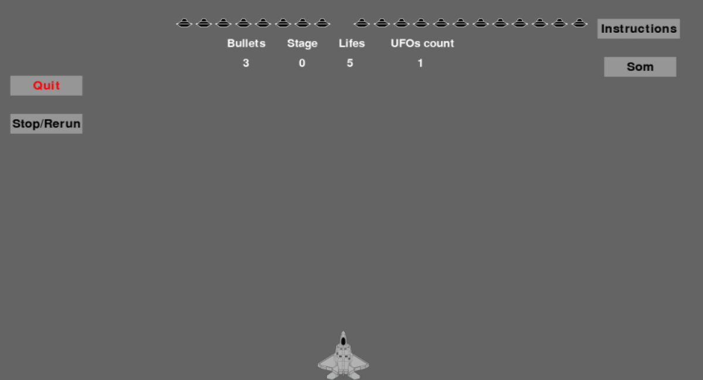
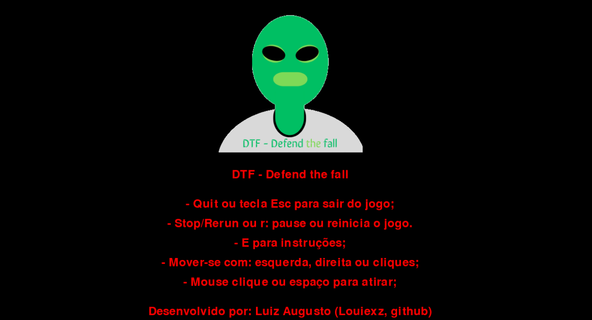

# InvasaoAlien-Pygame
Este é um jogo arcade simples construído com Pygame ao estudar o livro Curso Intensivo de Python, com algumas novas funcionalidades.

## Screenshots

## Funcionalidades

    Objetivo do jogo: Destrua os aliens antes que eles cheguem a base.
    Variados inimigos: Cada um dos aliens tem suas características.
    Nivelação: A cada 20 e 100 aliens, o jogo fica mais dinâmico.
    Multiplataforma, escolha onde jogar: Windows, Linux e APK.

## Pré-requisitos

### Certifique-se de ter o seguinte instalado antes de começar:
  
     Python 3
     Pygame

## Instalação e Uso

1. Baixe de acordo com sua plataforma:

    - Windows x64: https://drive.google.com/file/d/1dflv80mCJavK5f6-4rX_asGOtVYbnFH3/view?usp=sharing
    - Linux x86_64: https://drive.google.com/file/d/1LpOyaQLIjRHiZi3qLXVawWu3sIRgFg1V/view?usp=sharing
    - Apk: Em breve.

2. Ou siga os seguintes passos:

- Clone o repositório:

        git clone https://github.com/Louiexz/InvasaoAlien-Pygame.git
        cd InvasaoAlien-Pygame
 
 - Instale as dependências:

        pip install -r requirements.txt

 - Execute o aplicativo:

        python run.py

## Instruções do jogo:

## Estrutura do Projeto

    InvasaoAlien-Pygame/
    │
    ├── run.py             # Arquivo principal do aplicativo
    ├── assets/            # Diretório contendo arquivos necessários
    │   ├── imagens/           # Diretório contendo as imagens utilizadas
    │   |   ├── character/         # Imagens da espaçonave
    │   |   └── enemies/           # Imagens dos aliens
    │   |       └── aliens/           # Imagens dos aliens que aparecem na frota
    |   ├── scripts/           # Diretório contendo pastas de funções e/ou classes
    │   |   ├── game/              # Funções do jogo, loops e classe de botão
    │   |   |   ├── game_functs.pu    # Funções de texto, sons e chamadas para funções das balas
    │   |   |   ├── game_controls.py  # Funções de loop, fim de jogo e atualização da tela
    │   |   |   └── button.py         # Classe dos botões
    │   |   ├── main/              # Inicialização e configurações
    │   |   |   ├── start.py            # Inicialização de classes, configurações e loop
    │   |   |   └── settings.py         # Configurações gerais
    │   |   ├── character/         # Funções e classe da espaçonave
    │   |   |   ├── ship.py             # Classe da espaçonave
    │   |   |   ├── input_controls.py   # Funções de entrada
    │   |   |   └── bullet.py           # Classe das balas    
    │   |   └── enemies/           # Funções e classe de alien
    │   |       ├── alien.py           # Classe de alien
    │   |       └── aliens_functs.py   # Funções dos aliens
    |   └── sound/              # Diretório contendo sons do jogo
    |       ├── game               # Músicas e sons de fim
    |       ├── aliens             # Sons referentes a aliens
    |       └── ship               # Sons referentes a espaçonave
    └── requirements.txt    # Arquivo contendo as dependências do Python

## Contribuições
Louiexz - Autor e Desenvolvedor do jogo 

Contribuições são bem-vindas! Sinta-se à vontade para abrir issues ou pull requests.
